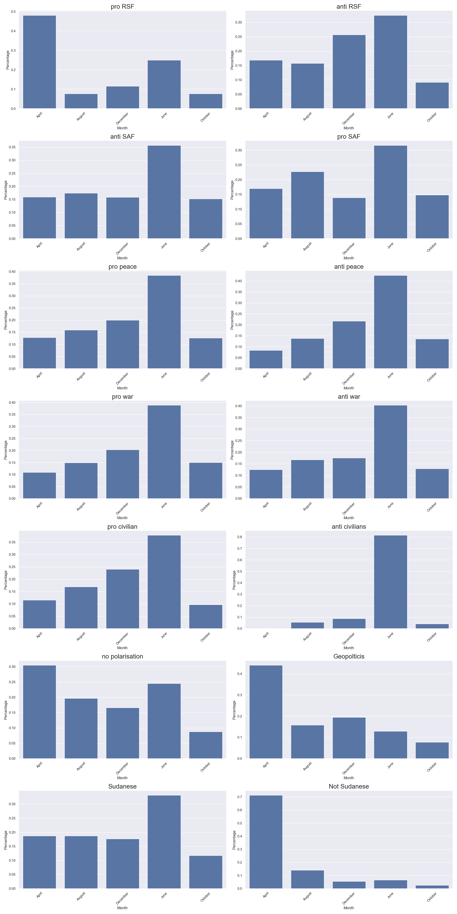

# arabic-polarization-twitter
This repository contains tools and scripts for analyzing Arabic Twitter discussions about the civil war in Sudan. It includes data collection methods, preprocessing steps, machine learning models for tweet classification, and analysis tools for understanding public opinion and geopolitical narratives.

## Repostiry Contents
The repository is organized as follows:
```
../
├── data/
│   ├── cleaned_data.csv
│   ├── combined_reports_with_preds_final.parquet
│   └── data.xlsx
├── embeddings/
│   └── labelled_embeddings.parquet
├── LICENSE
├── logs/
│   └── stratified_logs.pth
├── models/
│   ├── clf_anti peace.pth
│   ├── clf_Pro peace,.pth
│   ├── clf_RSF.pth
│   └── clf_SAF.pth
├── notebooks/
│   ├── 01_data_preprocessing.ipynb
│   ├── 02_model_training.ipynb
│   ├── 03_evaluation.ipynb
│   └── 04_analysis_visualization.ipynb
├── plots/
│   ├── binary_labels_counts_per_month.html
│   ├── binary_labels_counts_per_month_seaborn.png
│   └── labels_counts_percentage.html
└── reports/
    ├── Report 1.xlsx
    ├── Report 2.xlsx
    ├── Report 3.xlsx
    ├── Report 4.xlsx
    └── Report 5.xlsx
```

### Data 
The data folder contains the following files:
- `data.xlsx`: The Labelled 900 tweets dataset.
- `cleaned_data.csv`: The cleaned dataset after preprocessing.
- `combined_reports_with_preds_final.parquet`: The final dataset after merging the reports with the predictions.
All the reports 1-5 are in the reports folder.

### Embeddings
The embeddings folder contains the following files:
- `labelled_embeddings.parquet`: The OpenAI GPT-3 embeddings for the labelled dataset. The embeddings are in dataframe format with the tweet text crossponding to the embeddings. Embeddings are used for training the Classification models and the model_training notebook have code to get the embeddings from the OpenAI API.

### Logs
The logs folder contains the following files:
- `stratified_logs.pth`: The logs for the stratified KFold cross-validation for the classification models. This include the Loss, Accuracy, ROC-AUC and F1 scores for each fold for training and validation.

### Models
The models folder contains the following files:
- Some trained models for the classification tasks. The four examples shown are for clarifications and the models are not the final models used in the analysis. The final models can be found and used here: [Trained Models](https://github.com/ammarnasr/tweet-classification-app/tree/main/models)
- The models , result and inference tool can be accessed in this streamlit app: [Tweet Classification App](https://tweet-classification.streamlit.app)

### Notebooks
The notebooks folder contains the following files:
- `01_data_preprocessing.ipynb`: The notebook for the data preprocessing steps.
- `02_model_training.ipynb`: The notebook for the model training steps.
- `03_evaluation.ipynb`: The notebook for the evaluation of the models.
- `04_analysis_visualization.ipynb`: The notebook for the analysis and visualization of the results.

### Plots
The plots folder contains the following files:
- `binary_labels_counts_per_month.html`: The plot for the binary labels counts per month. The plot is interactive and can be viewed in the browser. 
- `labels_counts_percentage.html`: The plot for the labels counts percentage. The plot is interactive and can be viewed in the browser. 
- `binary_labels_counts_per_month_seaborn.png`: The plot for the binary labels counts per month. The plot is a seaborn plot.


